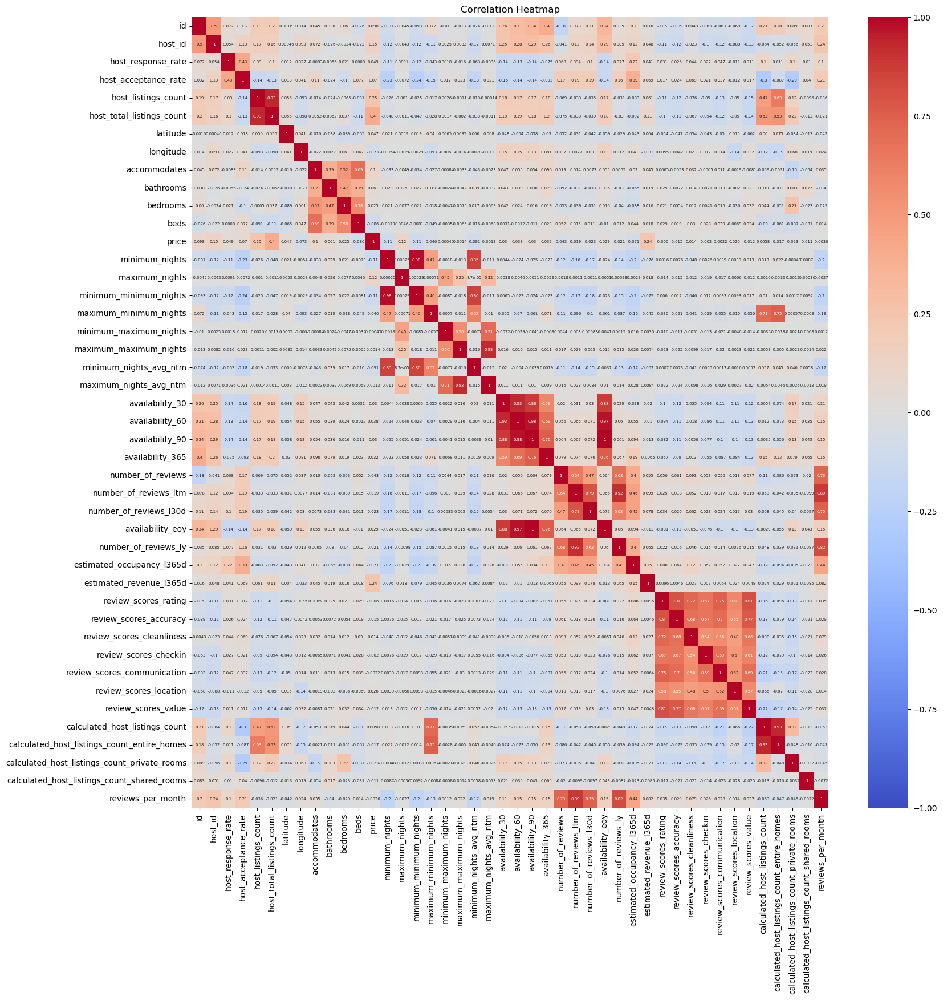
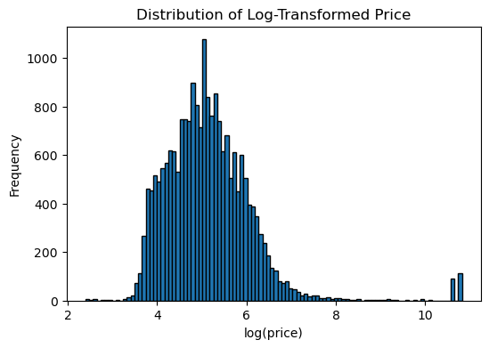
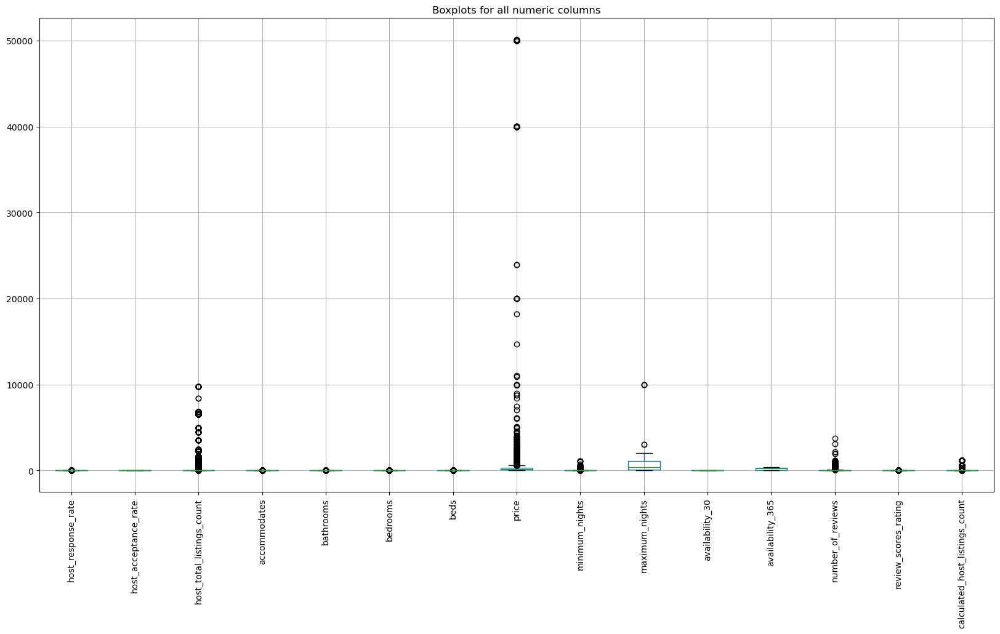

## Data Cleaning Process (Price Prediction Model)
### 1. Data Exploration & Initial Observations
To ensure robust model performance, an initial exploratory analysis was conducted to understand data structure and relationships.

#### Correlation Analysis

- Strong multicollinearity was observed among several feature groups:
  - **Availability variables**: `availability_30`, `availability_60`, `availability_90`, `availability_365`
  - **Review metrics**: multiple review-related variables capturing similar information over time
  - **Host listing counts**: overlapping measures of host scale

### 2. Handling Multicollinearity
To reduce redundancy and improve interpretability:
- Retained key variables:
  - `availability_30` (short-term demand)
  - `availability_365` (long-term demand)
  - `number_of_reviews` (core review metric)
  - `calculated_host_listings_count` (host scale)

- Removed highly correlated variables (correlation > 0.8)

### 3. Outlier & Distribution Analysis
#### Price Distribution (Log Transformation)

- Original `price` variable was **highly right-skewed with extreme outliers**
- Log transformation:
  - Reduced skewness  
  - Stabilized variance  
  - Improved suitability for regression  
Therefore, `log(price)` was used as the dependent variable

#### Outlier Detection

- Significant outliers were observed, especially in:
  - `price`
  - `minimum_nights`
  - `number_of_reviews`

### 4. Missing Value Treatment
- **Price (target variable)**:
  - Missing values were **dropped**
  - Reason: Median imputation reduced model performance (lower R²)

- **Continuous variables**:
  - Mean imputation applied  
  - (e.g., `host_response_rate`, `review_scores_rating`)

- **Categorical/discrete variables**:
  - Mode imputation applied  
  - (e.g., `bedrooms`, `bathrooms`, `host_is_superhost`)

- **Inactive listings**:
  - Removed based on `has_availability`

### 5. Feature Engineering
- Converted categorical variables into dummy variables:
  - `room_type`
  - `neighbourhood_group_cleansed`
  - `host_is_superhost`
  - `instant_bookable`

- Removed:
  - ID columns and URLs  
  - Text-based features  
  - Redundant geographic and time-based variables  

### 6. Final Outcome
After cleaning and transformation:
- Reduced dimensionality  
- Eliminated multicollinearity issues  
- Improved data quality and consistency  

📎 **Notebook:**  
[View Full Data Cleaning Process](./cleaned_price_prediction.ipynb)
