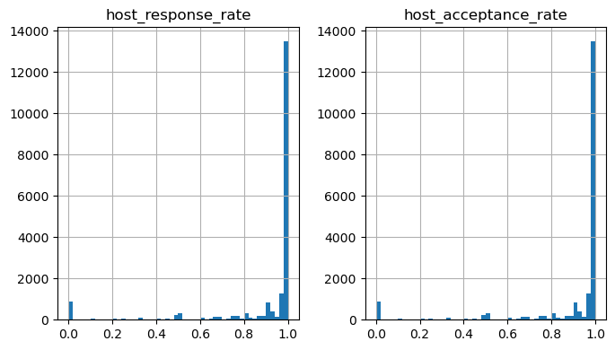
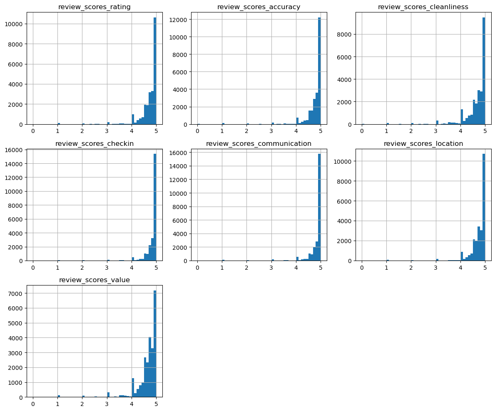

## 🧹 Data Preprocessing (Superhost Classification Model)

### 1. Data Overview & Challenges

The original dataset contained a large number of variables, including:
- Identification fields (IDs, URLs)
- Unstructured text data
- Redundant and highly correlated features

👉 These were removed to reduce noise and improve model efficiency.

---

### 2. Feature Engineering

Several raw variables were transformed into meaningful numerical features:

- **Amenities** → converted into `amenities_count`
- **Host response time** → ordinal encoding  
  (within an hour = 4 → a few days or more = 1)
- **Binary variables** → converted from `t/f` to `1/0`
- **Bathrooms** → extracted numeric values from text (`bathrooms_text`)
- **Time-based features**:
  - `host_tenure_days`
  - `days_since_last_review`
  - `days_since_first_review`

👉 These transformations help capture **host activity, engagement, and listing quality**

---

### 3. Distribution Analysis (Key Variables)

#### 📊 Host Response & Acceptance Rates

- Highly skewed toward **1 (near-perfect response/acceptance)**
- Indicates most active hosts maintain strong responsiveness
- Missing values likely represent **inactive or less engaged hosts**

---

#### ⭐ Review Score Distributions

- Strong right-skew toward high ratings (4–5 range)
- Suggests:
  - Most listings are positively rated
  - Lower ratings may be strong signals for non-superhosts

👉 These distributions confirm that **review-related variables are highly informative for classification**

---

### 4. Handling Missing Values

Unlike regression tasks, missing values here contain **behavioral signals**.

👉 Dropping rows would remove **30–40% of data** :contentReference[oaicite:0]{index=0}  
👉 Therefore, targeted imputation was applied:

#### Strategy:

- **Skewed numeric variables** (e.g., bathrooms, bedrooms):
  → Median imputation  

- **Review scores**:
  → Median imputation  

- **Behavioral variables (e.g., revenue, activity)**:
  → Filled with **0** (indicates no activity)

- **Review recency variables**:
  → Filled with **9999**  
  (represents listings with no reviews)

- **Host listing count**:
  → Imputed with **1 (mode)** instead of median  
  (better reflects typical small-scale hosts)

👉 This preserves both:
- Dataset size  
- Behavioral meaning of missing values  

---

### 5. Handling Target Imbalance

- Target variable: `host_is_superhost`
- Dataset is **imbalanced**

👉 Solution:
- Applied **downsampling / upsampling** to balance classes
- Prevents model bias toward majority class

---

### 6. Data Scaling & Preparation

- Data split:
  - 70% training  
  - 30% testing  

- Applied **StandardScaler**:
  - Fit on training data only  
  - Applied to both train & test sets  

👉 Prevents **data leakage** and ensures fair evaluation

---

### 7. Final Outcome

After preprocessing:
- No missing values remain  
- All variables are in numerical format  
- Dataset is balanced and ready for modeling  

👉 Enables robust performance for:
- Decision Tree  
- Random Forest  

---

📎 **Notebook:**  
[View Full Data Processing](./cleaned_superhost_classification.ipynb)
